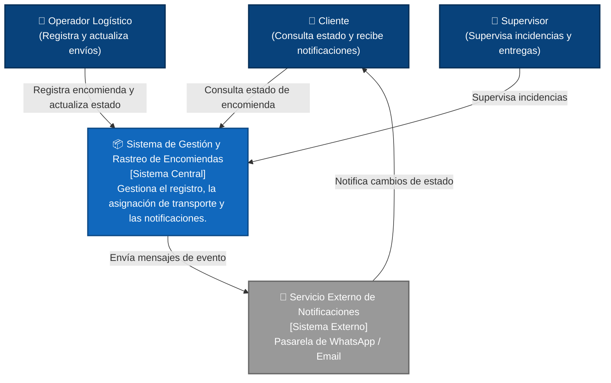
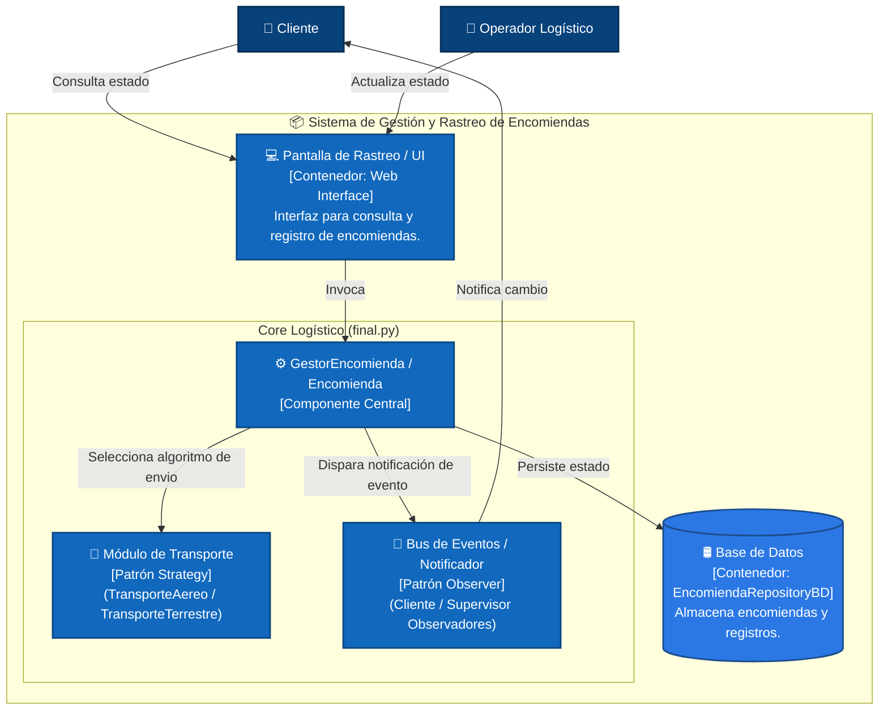

# Documentación de Arquitectura - Sistema de Gestión y Rastreo de Encomiendas

## 1. Diagrama C4 Nivel 1: Diagrama de Contexto

Muestra el sistema como una caja central, los actores del dominio y los sistemas externos integrados.

---

## 2. Diagrama C4 Nivel 2: Diagrama de Contenedores

Muestra los contenedores del sistema y la ubicación exacta de los dos patrones fusionados (**Strategy** y **Observer** en `final.py`).

