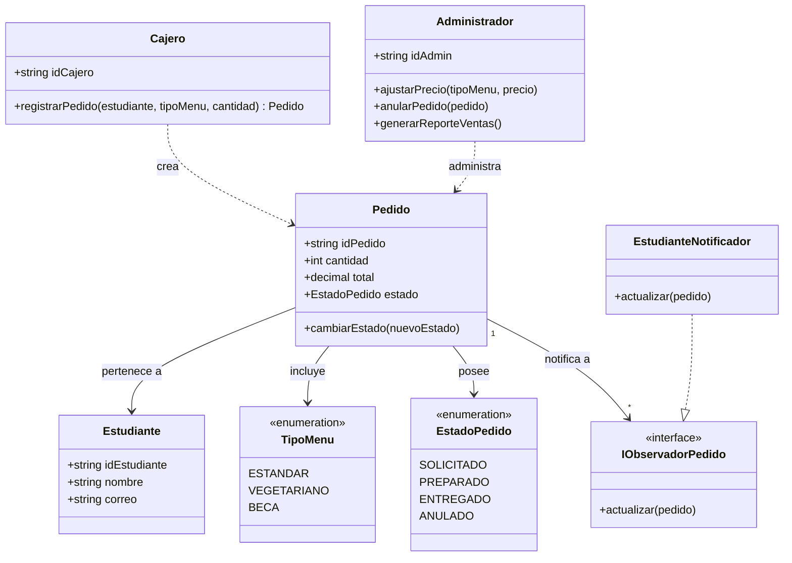

# Diagrama de Clases — Comedor Universitario "Sabor Andino"
**Estudiante:** Marco Antonio Checa Mamani

```mermaid
classDiagram
    class Estudiante {
        +string idEstudiante
        +string nombre
        +string correo
    }

    class Cajero {
        +string idCajero
        +registrarPedido(estudiante, tipoMenu, cantidad) Pedido
    }

    class Administrador {
        +string idAdmin
        +ajustarPrecio(tipoMenu, precio)
        +anularPedido(pedido)
        +generarReporteVentas()
    }

    class TipoMenu {
        <<enumeration>>
        ESTANDAR
        VEGETARIANO
        BECA
    }

    class EstadoPedido {
        <<enumeration>>
        SOLICITADO
        PREPARADO
        ENTREGADO
        ANULADO
    }

    class Pedido {
        +string idPedido
        +int cantidad
        +decimal total
        +EstadoPedido estado
        +cambiarEstado(nuevoEstado)
    }

    class IObservadorPedido {
        <<interface>>
        +actualizar(pedido)
    }

    class EstudianteNotificador {
        +actualizar(pedido)
    }

    Pedido --> Estudiante : pertenece a
    Pedido --> TipoMenu : incluye
    Pedido --> EstadoPedido : posee
    Cajero ..> Pedido : crea
    Administrador ..> Pedido : administra
    EstudianteNotificador ..|> IObservadorPedido
    Pedido "1" --> "*" IObservadorPedido : notifica a
```
