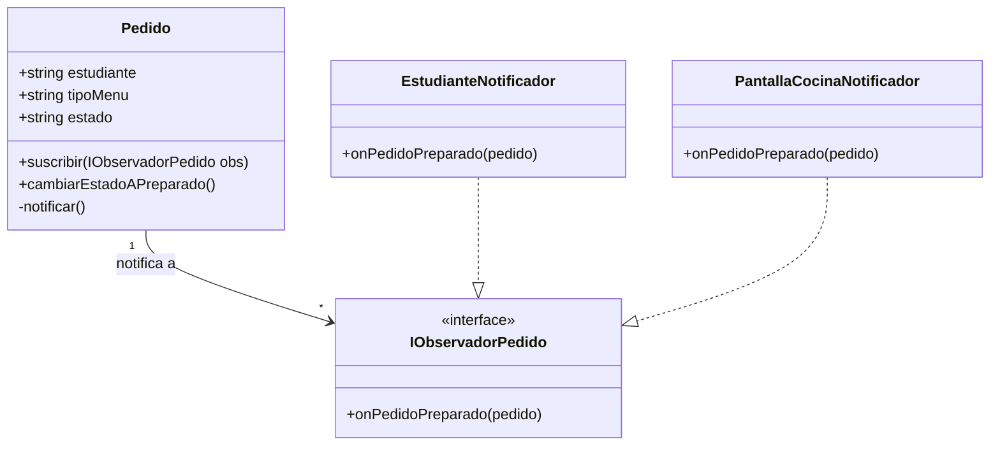

# Selección e Integración del Patrón — Observer (Observador)

## 1. Requerimiento del dominio
Cuando un pedido queda preparado, el estudiante debe recibir un aviso

## 2. Patrón aplicado
Observer (Publicador / Suscriptor)

## 3. Diseño del patrón en Diagrama (Mermaid)

## 4. Justificación
¿por que ese patron?: permite conectar o desconectar facilmente los canales
de notificacion. cuando el pedido cambia a preparado, pedido envia el
aviso sin importar si es por correo, app movil o pantalla de cocina

¿que pasa sin el?: pedido tendria que llamar directamente a clases
como correouniversitario.enviar(). esto une demasiado el pedido con
la mensajeria y afecta srp (responsabilidad unica) y ocp(abierto/cerrado)
porque para agregar otro canal habria que modificar pedido
